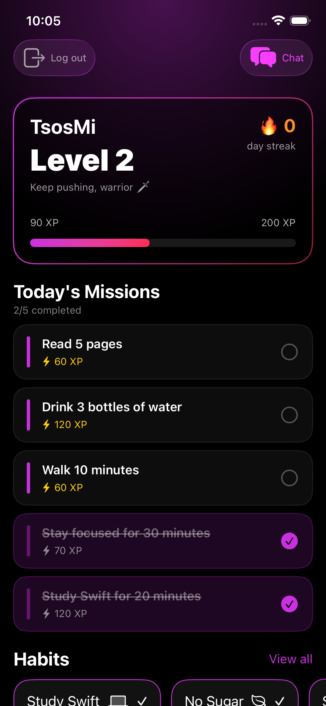
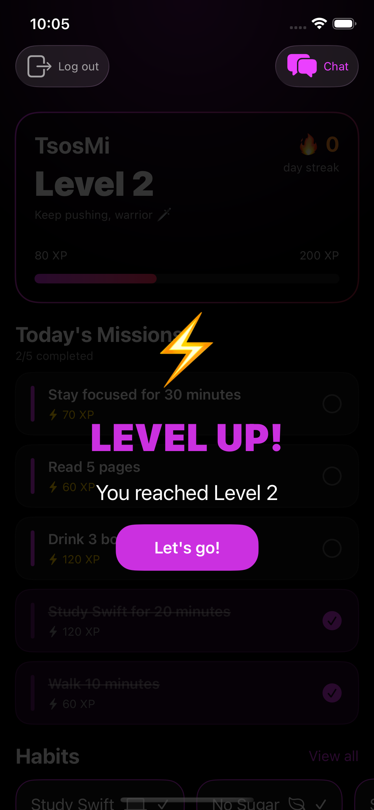
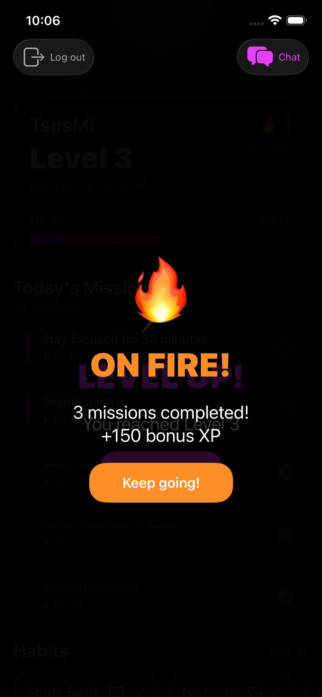
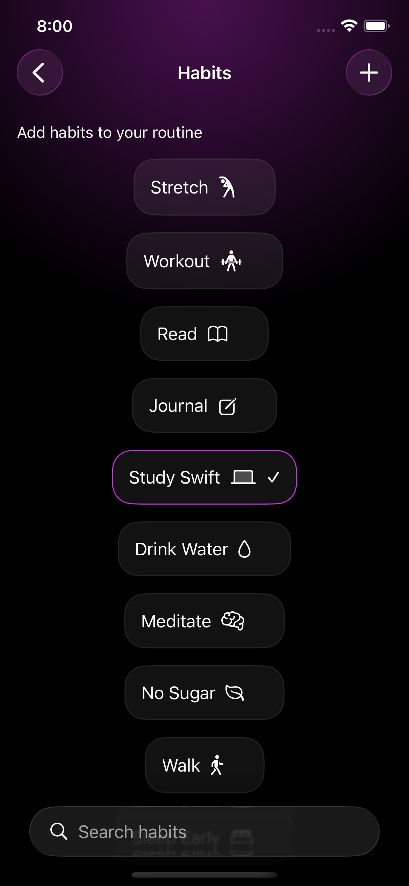

# 🔥 Momentum

**Momentum helps you build everyday habits and stay committed to them.**

Turn your daily habits into an RPG-style adventure — complete missions, earn XP, level up, and keep your streak alive. Momentum makes self-improvement feel rewarding.

---

## 📸 Screenshots

---

## 🎮 How It Works

1. **Choose your habits** — Select from a curated list of daily habits like Workout, Read, Meditate, Drink Water and more
2. **Complete daily missions** — Each day Momentum generates personalized missions based on your selected habits
3. **Earn XP and level up** — Every completed mission rewards you with XP. Fill the bar to reach the next level
4. **Keep your streak alive** 🔥 — Complete missions daily to build your streak. Miss a day and it resets
5. **Scale your challenge** — Every 3 days of streak your mission difficulty increases, keeping you always growing

---

## ✨ Features

- 🎯 **Daily Mission System** — Personalized missions generated from your selected habits with varying XP rewards
- ⚡ **XP & Leveling System** — Earn XP by completing missions and level up with satisfying celebrations
- 🔥 **Daily Streak Tracking** — Build consistency with a streak counter that resets if you miss a day
- 📈 **Progressive Difficulty** — Mission goals scale every 3 days of streak to keep you challenged
- 🏆 **On Fire Bonus** — Complete multiple missions in a row to trigger bonus XP rewards
- 🔔 **Smart Notifications** — Morning and afternoon reminders to keep you on track
- 🔍 **Habit Search** — Quickly find and manage your habits with built-in search
- 💾 **Persistent Progress** — All data saved locally using SwiftData so your progress is never lost
- 🎨 **Beautiful Dark UI** — Sleek purple themed design with smooth animations and celebration screens

---

## 🛠 Tech Stack

- **Swift**
- **SwiftUI**
- **SwiftData** — Local data persistence
- **MVVM Architecture** — Clean separation of concerns
- **UserNotifications** — Morning and afternoon habit reminders

---

## 🧠 What I Learned

- Implementing SwiftData in a real project for the first time
- Building a notification system with scheduled daily reminders
- Designing a gamification system — XP, levels, streaks and progressive difficulty
- Managing complex daily state — mission resets, streak logic and XP calculations
- Creating celebration animations and overlay screens in SwiftUI
- Building a search system for dynamic filtering of habits

---

## 🚀 Future Improvements

- More habit categories
- Weekly and monthly progress charts
- Achievement badges for milestones
- Social features — compare streaks with friends
- App Store release

---

## 👨‍💻 Author

Built by **Dimitris Polyzos** — iOS Developer in progress 🚀

- GitHub: [github.com/dimitrispolyzos99](https://github.com/dimitrispolyzos99)
- LinkedIn: [linkedin.com/in/dimitris-polyzos-106373259](https://linkedin.com/in/dimitris-polyzos-106373259)
