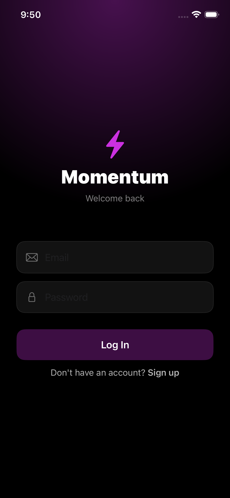
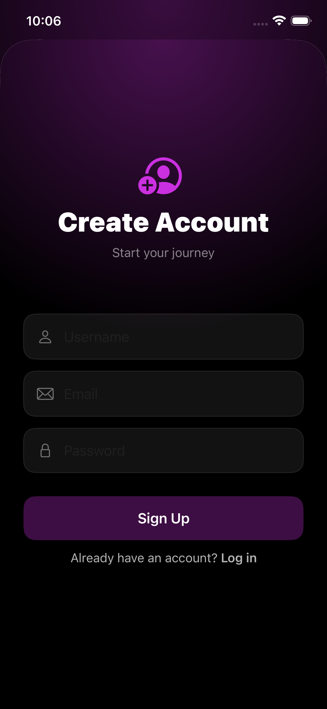
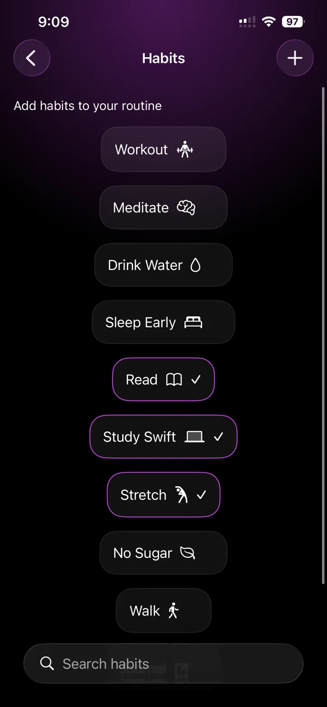

# Momentum — Gamified Habit Tracker

> *Turn your daily habits into an RPG experience. Build streaks, earn XP, level up.*

---

## Screenshots

<p float="left">
  
  
  
  
  
</p>

<p float="left">
  
  
</p>

---

## What is Momentum?

Momentum is a habit tracking app that works like an RPG. Every day you get a set of missions based on your selected habits. Complete them, earn XP, level up, and keep your streak alive. Miss a day — your streak resets. Simple, but surprisingly addictive.

It started as a portfolio project. It ended up being something I actually use every day.

---

## Features

- **Daily Mission System** — missions are generated each morning based on your selected habits, with difficulty that scales every 3 days as your streak grows
- **XP & Leveling** — complete missions to earn XP, level up, and get bonus XP when you hit your daily goal
- **Streak Tracking** — consecutive days of hitting your daily goal build your streak. Miss a day and it resets — no mercy
- **Firebase Authentication** — full sign up / login flow with email validation and secure token storage in the iOS Keychain
- **Multi-User Support** — each user's habits, missions, and progress are completely isolated via Firestore. Switch accounts and see a clean slate
- **Real-Time Chat** — users can message each other via Firestore-backed chat with unread indicators
- **Push Notifications** — morning reminder at 9 AM to start your missions, and an evening check-in at 8 PM
- **Swipe to Complete** — drag a mission card to the right to mark it done
- **19 Unit Tests** — covering XP logic, level ups, streak resets, daily goal bonuses, and email validation

---

## Tech Stack

| Area | Technology |
|---|---|
| UI | SwiftUI |
| Architecture | MVVM + SOLID Principles |
| Local Persistence | SwiftData |
| Authentication | Firebase Auth |
| Cloud Database | Firestore |
| Secure Storage | iOS Keychain |
| Async | async/await, Combine |
| Testing | Swift Testing framework |
| Notifications | UserNotifications |

---

## Project Structure

```
Momentum/
├── App/
│   └── MomentumApp.swift
├── Model/
│   ├── Habit.swift
│   ├── Mission.swift
│   ├── MissionTemplate.swift
│   ├── PlayerProgress.swift
│   ├── Message.swift
│   └── User.swift
├── View/
│   ├── Auth/
│   ├── Home/
│   │   └── Components/
│   ├── Habits/
│   └── Chat/
├── ViewModel/
│   ├── HomeViewModel.swift
│   ├── LoginViewModel.swift
│   ├── SignupViewModel.swift
│   └── ChatViewModel.swift
└── Service/
    ├── AuthState.swift
    ├── KeychainManager.swift
    ├── NotificationManager.swift
    ├── ChatService.swift
    └── UserService.swift
```

---

## Architecture Decisions

**Why MVVM?**
Views in Momentum are purely visual — they don't make decisions. All logic lives in ViewModels. This makes the code easier to read, easier to test, and easier to change without breaking things.

**Why SOLID?**
Each class has one job. `KeychainManager` handles the Keychain. `NotificationManager` handles notifications. `AuthState` listens to Firebase auth changes. When something breaks, you know exactly where to look.

**Why SwiftData + Firestore together?**
SwiftData handles fast local reads — the UI never waits for a network call. Firestore handles user identity and chat. Each SwiftData record carries a `userId` field that links it to the Firebase account, so multi-user support works correctly even on the same device.

**Dependency Injection in tests**
The `HomeViewModel` accepts a `PlayerProgress` and missions array from outside — it doesn't create them internally. This means unit tests can pass in controlled test data without needing a SwiftData container or Firebase connection.

---

## Unit Tests

All 19 tests live in `MomentumTests/MomentumTests.swift` and test real ViewModel logic:

- XP increases and decreases correctly when toggling missions
- XP never goes below 0 at level 1
- Level up triggers correctly when XP crosses the threshold
- XP carries over after a level up
- Daily goal bonus (150 XP) is awarded after 3 completions
- Streak increases after hitting the daily goal
- Bonus XP is not awarded twice
- Streak resets when daily goal was missed
- Streak is preserved when daily goal was hit
- Mission reset triggers correctly on a new day
- Daily reset doesn't run twice on the same day
- Email validation accepts valid emails
- Email validation rejects invalid formats
- `canSubmit` is false when password or email is empty

---

## What I Learned Building This

I built Momentum to push past tutorial-level Swift. The things that forced me to actually think:

- Multi-user data isolation — it's not enough to just have auth. Every record needs to know who it belongs to.
- Testing ViewModels that depend on SwiftData — the solution was to pass dependencies in from outside rather than create them internally. That led me to properly understand Dependency Injection.
- Auth state management — instead of each View managing its own `isLoggedIn` flag, a single `AuthState` object listens to Firebase and drives the entire navigation tree.
- SOLID in practice — I didn't set out to write SOLID code. I refactored toward it when I noticed things getting hard to change.

---

## Author

**Dimitris Polyzos** — Self-taught iOS Developer, Athens, Greece

- GitHub: [github.com/dimitrispolyzos99](https://github.com/dimitrispolyzos99)
- LinkedIn: [linkedin.com/in/dimitris-polyzos-106373259](https://linkedin.com/in/dimitris-polyzos-106373259)
